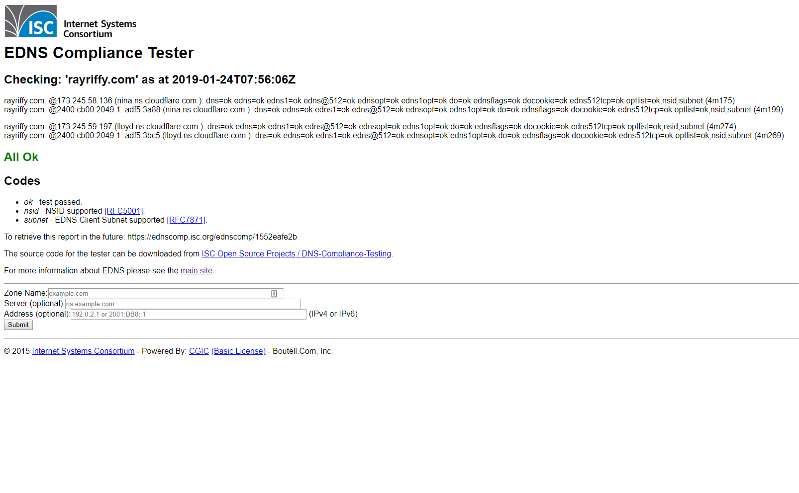

เราจะขอมาขั้นรายการ Blog ทุกอย่างที่อยู่ในคิวแล้วออกมาเตือนเรื่อง DNS Flag Day กันหน่อยเพราะเห็นว่าหลายคนไม่รู้จักกัน

## อะไรคือ DNS Flag Day?

DNS Flag Day จะเป็นวันที่ผู้ให้บริการ DNS (DNS Provider) และผู้ที่สร้าง Software DNS รายใหญ่เช่น BIND, Unbound จะกำหนดให้ **DNS ทั้งหมดจะต้องรองรับมาตรฐาน EDNS** โดยถ้าโดเมนเรา หรืออุปกรณ์ที่ผลิตออกมาไม่รองรับมาตรฐาน EDNS ก็จะไม่สามารถเชื่อมต่อกับ DNS Server ปลายทางได้

## เรื่องเกี่ยวกับ DNS และ EDNS

**DNS** (**D**omain **N**ame **S**ystem) เป็น standard protocol ที่ไว้ใช้เชื่อมต่อกับอินเตอร์เน็ต โดยการพิมพ์ชื่อโดเมนตรงๆ แล้ว DNS ก็จะเอา IP Address ปลายทางของโดเมนนั้นมาให้เชื่อมต่อ

ยกตัวอย่างเช่น ถ้าพิมพ์โดเมน `pornhub.com` เข้าไปใน Browser หลังกด ENTER ไปแล้ว Browser จะวิ่งไปหา DNS Server เพื่อหาว่า IP Address ของ `pornhub.com` คืออะไร จากนั้น DNS ก็จะตอบมาว่า IP ของ `pornhub.com` คือ `216.18.168.16` Browser ก็จะเชื่อมต่อเว็บไปที่ IP นั้นโดยบอกว่ามาจากโดเมน `pornhub.com`

DNS เนี่ยก็มีมาตั้งแต่ 1982 แล้วแต่ก็มีการพัฒนามาตรฐานของ DNS ให้ปลอดภัย และดียิ่งขึ้นมาเรื่อยๆ อยู่ตลอดเวลา แต่จุดการพัฒนาที่สำคัญที่สุดคือการที่ประกาศใช้ **EDNS** (**E**xtension Mechanisms for **DNS**) ในปี 1999 โดยมีจุดเปลี่ยนแปลงที่สำคัญอย่างเช่น

- การใช้งาน [DNSSEC](https://www.ietf.org/rfc/rfc4033.txt) ในการยืนยัน Server
- การใช้งาน [DNS Cookie](https://tools.ietf.org/html/rfc7873) เพื่อป้องกัน [DoS](https://en.wikipedia.org/wiki/Denial-of-service_attack) (**D**enial **o**f **S**ervice Attack)

โดยในตลอด 20 ปีที่ผ่านมา DNS Provider ต่างๆ ยังไม่พร้อมที่จะรับรองมาตฐานนี้ ทำให้ที่ผ่านมาทั้งนักพัฒนา Software และ DNS Provider ใช้วิธีแก้ปัญหาเฉพาะหน้าโดยยอมรับการเชื่อมต่อกับระบบที่ยังไม่รองรับมาตรฐาน EDNS ไปก่อน

คราวนี้เพราะความเคยชิน ทำให้ตอนนี้ DNS Provider ทำงานได้ช้าเพราะว่าต้องมารองรับมาตรฐานเก่า และมาตรฐานใหม่ในเวลาเดียวกัน รวมถึงการที่ต้องมาตรฐาน DNS เก่า ทำให้เห็นถึงข้อจำกัดในการพัฒนา Software

ทำให้มีการตกลงกันระหว่างนักพัฒนา Software DNS กับ DNS Provider ว่าจะให้ DNS ในอินเตอร์เน็ตต้องรองรับมาตรฐานใหม่ของ EDNS เท่านั้นนั่นเองงงง

## แล้ววันนั้นมันวันไหน?

1 กุมภาพันธ์ 2019 หรือพูดง่ายๆว่าเหลือเวลาเกือบไม่ถึง 1 อาทิตย์แล้ว

## เราควรทำอย่างไร

อย่างแรกเลยคือลองเช็คโดเมนของตัวเองว่า จะรอดหรือไม่

ไปที่ [https://ednscomp.isc.org/ednscomp/](https://ednscomp.isc.org/ednscomp/) แล้วในช่อง Zone name ให้ใส่ชื่อโดเมนของตัวเองเข้าไปแบบไม่มี `www` แล้วก็ Submit ไป

ถ้าหากเห็นคำว่า All Ok เป็นสีเขียวก็ขอแสดงความยินดีด้วย! ท่านรอดจาก DNS Flag Day แน่นอน!!!

แต่ถ้าเป็นสีอื่นก็ต้องมาเช็คโดเมนของตัวเองแล้วว่า

- อัพเดต DNS Software ล่าสุดหรือยัง?
- ตั้งค่าให้รองรับ EDNS ยัง?
- เช็ค Firewall ให้ถูกต้อง เช่น ตั้งให้ packet UDP ขนาด 512 bytes ขึ้นไปผ่านได้

## สรุป

เราก็จะออกมาเตือนแค่นี้แหละ ที่เหลือเป็นหน้าที่ของผู้ดูแลระบบที่กำลังอ่าน Blog นี้อยู่ว่า "คุณพร้อมหรือยัง?"
