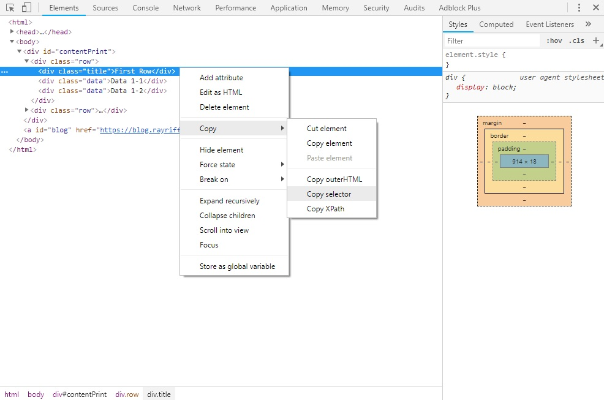

สวัสดีครับ ในสัปดาห์นี้เราจะมาสอนทำ Web Scraping กันโดยใช้ library ที่ชื่อว่า **cheerio** กันนะครับ >w<

**Web Scraping** เป็นการดึงข้อมูลดิบๆ ทางทางเว็บไซต์เพื่อเอาตัวแปร หรือค่าต่างๆ เอาไปประมวลผลต่อไป

งั้นเราก็มาเริ่มต้นการทำ Web Scraping กันเลยดีกว่า

เราจะใช้ HTML อันนี้เป็นตัวอย่างการเขียน Web Scraping สมมุติว่าหน้านี้อยู่ใน `https://example.com/`

`gist:rayriffy/63b342a5796f935bb5de0849851bb0bb`

เราก็จะมาเริ่มเขียนกันเลย

### ขั้นตอนที่ 1: ติดตั้ง Dependencies ให้พร้อม

การติดตั้งก็ง่ายมาก แค่ใช้ `npm` หรือ `yarn` ในการติดตั้ง dependencies

ก็เริ่มจากลง **cheerio** ก่อน

```
$ yarn add cheerio
```

แล้วเราจะรับ raw HTML มาจาก **request-promise**

```
$ yarn add request-promise
```

### ขั้นตอนที่ 2: โค๊ดแม่ง

คราวนี้ใน `src/index.js` ของเราก็จะ import และ intitialize dependency

**คำเตือน!** อันนี้เราจะเขียนใน ES6 ต้องเอาโค๊ดไป compile เป็น JS ก่อนถึงจะใช้งานได้ (แนะนำให้ใช้ [backpack-core](https://github.com/jaredpalmer/backpack))

`gist:rayriffy/7448786472afc10af45e02241d90af21`

เราก็จะเริ่มโดยการใช้ request-promise ฝนการไปดึง data มากจากเว็บก่อน

`gist:rayriffy/5bef968a76abc9b2dc334a4e825e4435`

Pause แค่นี้ก่อนเรามาอธิบายโค๊ดส่วนนี้สักนิสนึง

```
rp({
  uri: `https://example.com/`,
  transform: body => {
    return cheerio.load(body)
  },
})
```

โค๊ดนี้เราบอกว่าให้ไปดึงข้อมูลมากจาก `https://example.com/` แล้วหลังจากดึงมากแล้วให้ *transform* โดยใช้ cheerio load ข้อมูลมา

```
  .then($ => {
    console.log($)
  })
  .catch(e => {
    console.error(e)
  })
```

ถ้าหากรับข้อมูลผ่านก็จะเข้าไปที่ `.then()` แต่ถ้าไม่ผ่านก็จะวิ่งไป `.catch()`

แล้วเราก็จะมา Scraping ข้อมูลกันเลยดีกว่า! 

เอาของง่ายๆ มากันก่อน เราจะดึงคำว่า First Row ยังไง? คำตอบคือเราจะต้อง Specify ด้วย Selector วิธีที่ง่ายที่สุดคือให้เราเปิด DevTools ขึ้นมาบนเว็บเลื่อนหา First Row แล้วคลิดขวาไปที่ **Copy > Copy selector** แล้วเราก็จะได้ Selector ออกมาแล้ว



แล้วเราก็เอาไปใส่ cheerio แล้วบอกให้แสดง text ออกมา

`gist:rayriffy/7aa24bdd920c61bd73018b11e8744f49`

เราจะสามารถ Extract text ออกมาจาก Selector นั้นได้ด้วยการใช้ `.text()`

```
$('#contentPrint > div:nth-child(1) > div.title').text()
```

`:nth-child(1)` มีไว้เพื่อบอกว่าให้วิ่งเข้าไปที่ div อันแรก ถ้าสังเกตดีๆ จะเห็นว่าในหน้าเว็ยเราก่อนที่จะเข้าไปที่ **div.title** นั้นมี **div.row** ที่เป็นชื่อซ้ำกันอยู่ เราถึงใช้ `:nth-child(1)` เพื่อบอกว่าให้วิ่งไปอันแรก

ง่ายๆคือ ถ้าเป็นเป็น `:nth-child(2)` มันก็จะวิ่งไปที่ *Second Row* แทน แต่ถ้าเอาออกไปเลยล่ะ!????? มันก็จะเข้าทั้งคู่เลย แล้วเก็บข้อมูลออกมาเป็น Array นั่นเอง!!!


เราก็เรียกออกมาได้ด้วยการ Loop

`gist:rayriffy/a9f0f3b04a379d2242f7d8a1cc972b86`

จากที่เห็น cheerio มี Function ที่ช่วยในการทำ Loop ให้แล้วโดยใช้ `.each()` แล้วจะมี parameter อยู่ 2 ตัว

-   `i` จะเป็นเลข Indexes เผื่อต้องการใช้
-   `elem` จะเป็น Element ใน Loop นั้น

แล้วเราก็เอา `elem` ออกมา Extract text ออกมา

```
$(elem).text()
```

ความรู้เพียงแค่นี้ก็สามารถเอาไปเขียน Web Scraping ได้จริงแล้ว แต่เดี๋ยวนะริฟฟี่! ใน **a#blog** มี href ด้วยอ่ะจะเอาออกมายังไง?

เราสามารถดึง HTML Attribute ต่างๆ ออกมาได้ด้วยการใช้ `.attr()`

`gist:rayriffy/d5ef10648d493572aec47e3960663b44`

ว่าจากตัวอย่างโค๊ดน่าจะเดาได้นะว่าเกิดอะไรขึ้น

### สรุป

จากตัวอย่างแค่นี้ เราก็สามารถทำ Web Scraping ได้แล้ว ตัวอย่างโปรเจคของเราก็จะเป็น API ที่เอาไว้ตรวจหวย คือใช้ cheerio ไปดึงข้อมูลมาจาก sanook.com แล้วเอา data ประมวลผลออกมาเป็น JSON

ตัวอย่างที่ [GitHub](https://github.com/rayriffy/thai-lotto-api)

แล้วคำแนะนำเพิ่มเติมคือ ถ้าอยากจะหรูหรามากกว่านี้แนะนำให้ลองไปดู [Puppeteer](https://github.com/GoogleChrome/puppeteer) แต่หลักๆ แล้วแค่นี้ก็ทำได้เพียงพอแล้ว ก็หวังว่าจะได้ความรู้อะไรกลับไปบ้างนะครับ 555 ขอบคุณที่อ่านมาถึงจุดนี้ครับ แล้วเจอกันอีกทีสัปดาห์หน้า!

### Resources Link

-   [cheerio Documentation](https://cheerio.js.org/)
